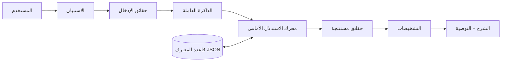

# التوثيق الشامل — نظام خبير لتشخيص مشاكل الحاسوب

> هذه الوثيقة الموحّدة تحلّ مكان جميع ملفات التوثيق السابقة (تحليل المشكلة،
> قاعدة المعرفة، تصميم الاستدلال، الاختبار والتقييم، دليل المبتدئين، الأسئلة
> الشائعة، التقرير النهائي، سيناريو العرض، هيكل التقرير الأكاديمي). كل ما
> يخصّ المشروع موجود هنا باللغة العربية.

---

## 1. مقدمة

نظام خبير يعمل من سطر الأوامر مكتوب بلغة بايثون خالصة، يهدف إلى تشخيص
فئات عامة من مشاكل الحاسوب. يسأل النظام المستخدم مجموعة صغيرة من الأسئلة
من نوع نعم/لا المتعلقة بالمشكلة المختارة، يجمع الإجابات كحقائق، ثم يستخدم
**محرك استدلال أمامي** (Forward Chaining) فوق **قاعدة معارف من القواعد
الشرطية إذا-فإن** المخزّنة في ملف JSON لإنتاج تشخيصات محتملة مع شرح
بسيط وتوصيات آمنة.

المشروع عبارة عن عرض أكاديمي لمفاهيم الأنظمة الخبيرة الكلاسيكية:
قاعدة المعارف، الذاكرة العاملة، قواعد إذا-فإن، الاستدلال الأمامي، الشرح
المنطقي، والفصل الواضح بين المعرفة (البيانات) ومنطق الاستدلال.

## 2. المتطلبات وطريقة التشغيل

**المتطلبات:**

- بايثون 3.9 أو أحدث.
- لا توجد أي مكتبات خارجية (المكتبة القياسية فقط).

**تشغيل البرنامج:**

```bash
python3 main.py
```

**فحص صياغة الملفات:**

```bash
python3 -m py_compile main.py engine.py questionnaire.py knowledge_base.py models.py bilingual.py
```

## 3. تحليل المشكلة

### 3.1 وصف المشكلة

قد يواجه مستخدم الحاسوب أعراضًا مثل: عدم التشغيل، شاشة فارغة، فشل الإقلاع،
بطء الأداء، ارتفاع الحرارة أو الانطفاء المفاجئ، فشل الشبكة، مشاكل التخزين،
مشاكل الذاكرة، أو عدم استجابة الأجهزة الطرفية.

يحاول النظام الاستدلال من الأعراض المرصودة إلى **أسباب محتملة عامة**.
لا يحاول تحديد المكوّن المعطوب بدقة في كل حالة؛ بل يعيد فئات تشخيصية عامة
مثل «مشكلة في الطاقة» أو «مشكلة في الشبكة»، ويمكن إرجاع أكثر من تشخيص واحد
عندما تدعم الأدلة ذلك.

### 3.2 المستخدم المستهدف

المستخدمون العامون أو الطلاب ذوو المعرفة الأساسية بالحاسوب. لذلك يعتمد
الاستبيان أسئلة نعم/لا بلغة بسيطة ويتجنّب المصطلحات التقنية مثل POST أو
DHCP lease.

### 3.3 الأهداف

- جمع أعراض المستخدم عبر مجموعة صغيرة من الأسئلة ذات الصلة.
- تمثيل الأعراض كحقائق داخلية.
- تطبيق قواعد خبير مخزّنة في قاعدة معارف منفصلة.
- استنتاج فئات المشاكل المحتملة بالاستدلال الأمامي.
- شرح المنطق وراء كل نتيجة بلغة بسيطة.
- تقديم توصيات بسيطة وآمنة.

### 3.4 النطاق

يغطي النظام أجهزة **المكتبي** و**المحمول** في المجالات التالية:
الطاقة، العرض، الإقلاع/نظام التشغيل، الأداء، ارتفاع الحرارة، الشبكات،
التخزين، الذاكرة، والأجهزة الطرفية.

### 3.5 ما ليس من أهداف المشروع

- تشخيص دقيق على مستوى المكوّنات.
- درجات الاحتمالية أو الثقة.
- إصلاحات أو إجراءات غير آمنة.

## 4. البنية المعمارية

مبدأ الفصل هو المطلب الأساسي في المشروع: المعرفة في البيانات، والآلية في
الكود.

```
المستخدم ← الاستبيان ← حقائق ← الذاكرة العاملة ← محرك الاستدلال الأمامي
                                                    ⇄ قاعدة المعارف (JSON)
                                                      ↓
                                              تشخيص + شرح + توصية
```

| الملف | المسؤولية | منطق المجال؟ |
|-------|-----------|--------------|
| `main.py` | نقطة الدخول: اختيار اللغة، نوع الجهاز، القائمة، الأسئلة، عرض النتيجة | العرض فقط |
| `questionnaire.py` | ربط المشكلة المختارة بالأسئلة ذات الصلة؛ تحويل الإجابات إلى حقائق | لا (لا تشخيص) |
| `engine.py` | الاستدلال الأمامي العام (`InferenceEngine`، `WorkingMemory`) | لا — عام فقط |
| `knowledge_base.py` | تحميل `data/*.json` والتحقق منها؛ أخطاء مقروءة | التحقق فقط |
| `models.py` | هياكل البيانات: `Rule`، `Question`، `MainProblem`، `FiredRule`، `WorkingMemory` | — |
| `bilingual.py` | عرض النصوص بلغة الجلسة المختارة (en/ar) | لا |
| `data/knowledge_base.json` | 34 قاعدة إذا-فإن + بيانات التشخيصات (إنجليزي/عربي) | **كل المعرفة** |
| `data/questions.json` | 9 مشاكل رئيسية + 35 سؤالًا (en/ar)، مع `laptop_only` | — |

أفكار أساسية:

- **المعرفة بيانات لا كود.** القواعد الـ34 موجودة في `data/knowledge_base.json`
  والمحرك لا يفهم سوى مفاهيم عامة (شروط واستنتاجات) بلا أي منطق تشخيصي.
- **الاستدلال الأمامي.** يكرر المحرك العثور على القواعد المتحققة، يفعّلها
  بترتيب حتمي، ويضيف الحقائق المستنتجة إلى الذاكرة العاملة حتى الوصول إلى
  نقطة ثابتة. بعض التشخيصات تتطلب سلاسل متعددة الخطوات
  (مثل: `facts ← cooling_problem ← Overheating problem`).
- **الشرح.** كل قاعدة تحمل شرحًا مقروءًا والتشخيصات النهائية تحمل توصيات
  آمنة.

## 5. قاعدة المعرفة

قاعدة المعرفة مخزّنة بصيغة JSON في `data/knowledge_base.json`، وهي منفصلة
تمامًا عن محرك الاستدلال؛ المحرك يعرف فقط كيف يفكر في القواعد التي تُعطى له.
كل نص موجه للمستخدم يخزَّن ككائن ثنائي اللغة: `"en"` (إنجليزية) و `"ar"`
(عربية).

### 5.1 مصادر المعرفة التشخيصية

- أدلة إصلاح أجهزة الحاسوب الشخصي التي تربط الأعراض بالأسباب (مثل:
  «لا مؤشر طاقة ولا مروحات ← تحقق من توصيل الطاقة ومصدر الطاقة»).
- وثائق دعم أنظمة التشغيل لإصلاح بدء التشغيل والوضع الآمن واستكشاف أخطاء
  الشبكة (مثل: «يصل إلى الموجه لكن لا يصل إلى الإنترنت ← مشكلة اتصال خارج
  الشبكة المحلية»).
- وثائق أساسية للعتاد لفحص سلامة الذاكرة والقرص (إدارة المهام، أدوات فحص
  القرص) واستكشاف الأجهزة الطرفية (جرّب منفذًا آخر، جهازًا آخر، تحقق من
  برنامج التشغيل).

### 5.2 تصنيفات الحقائق

| الفئة | أمثلة على الحقائق |
|-------|-------------------|
| الطاقة | `power_led_on`, `fans_not_running`, `power_cable_loose`, `outlet_power_fails` |
| العرض | `screen_blank`, `post_screen_blank`, `external_monitor_works` |
| الإقلاع / نظام التشغيل | `os_loading_screen_visible`, `bsod_occurs`, `post_screen_visible` |
| الأداء | `os_loads_slowly`, `programs_launch_slowly`, `many_startup_programs` |
| ارتفاع الحرارة | `computer_hot`, `shuts_down_unexpectedly`, `vents_blocked`, `fan_unusually_noisy` |
| الشبكة | `wifi_connected`, `router_reachable`, `internet_unreachable`, `ip_address_missing` |
| التخزين | `disk_nearly_full`, `disk_activity_high`, `disk_errors_reported` |
| الذاكرة | `ram_usage_high`, `system_freezes`, `ram_sticks_missing` |
| الملحقات | `device_not_detected`, `device_fails_any_port`, `driver_issue` |

مفردات الحقائق موحّدة ومشتركة بين الفئات (اسم واحد لكل مفهوم) لتجنّب
التكرار أو التعارض. عند إضافة سؤال/حقيقة يجب الحفاظ على الاتساق.

### 5.3 الحقائق الوسيطة

حقائق يُستنتج بين الإدخال والتشخيص لإظهار الاستدلال المتسلسل الحقيقي:

- `power_delivery_issue`, `internal_power_fault`
- `display_path_fault`, `backlight_or_panel_fault`
- `os_boot_reached`, `os_boot_failed`
- `system_slow_indicators`, `startup_overload`
- `cooling_problem`
- `local_connectivity_only`
- `storage_pressure`, `memory_pressure`

### 5.4 التشخيصات النهائية

| الحقيقة | الاسم بالعربية | الاسم بالإنجليزية |
|---------|----------------|-------------------|
| `diagnosis_power` | مشكلة في الطاقة | Power problem |
| `diagnosis_display` | مشكلة في الشاشة | Display problem |
| `diagnosis_boot` | مشكلة في الإقلاع/نظام التشغيل | Boot / operating-system problem |
| `diagnosis_performance` | مشكلة في الأداء | Performance problem |
| `diagnosis_overheating` | مشكلة في ارتفاع الحرارة | Overheating problem |
| `diagnosis_network` | مشكلة في الشبكة | Network problem |
| `diagnosis_storage` | مشكلة في التخزين | Storage problem |
| `diagnosis_memory` | مشكلة في الذاكرة | Memory problem |
| `diagnosis_peripheral` | مشكلة في الملحق/الجهاز الطرفي | Peripheral/device problem |

أي حقيقة تبدأ بالبادئة `diagnosis_` يُعاملها النظام كتشخيص نهائي.

### 5.5 القواعد (34 قاعدة)

الشروط كلها شرط **و** (يجب أن تتوفر جميعًا). للمنطق «أو» تُكتب قواعد منفصلة
(مثل P1 وP2 وكلتاهما تستنتج `power_delivery_issue`).

| القاعدة | الشروط ← الاستنتاجات | الشرح |
|---------|-----------------------|-------|
| P1 | `power_cable_loose` → `power_delivery_issue` | كابل الطاقة غير موصول بإحكام، لذلك قد لا يصل التيار الكهربائي إلى الحاسوب. |
| P2 | `outlet_power_fails` → `power_delivery_issue` | مقبس الحائط لا يزود بالكهرباء بشكل صحيح، لذلك لا يمكن للحاسوب استقبال التيار. |
| P3 | `power_delivery_issue` + `power_led_off` → `diagnosis_power` | مؤشر الطاقة مطفأ وقد استنتج النظام وجود مشكلة في إيصال الطاقة إلى الحاسوب، مما يشير إلى مشكلة في الطاقة. |
| P4 | `power_led_off` + `fans_not_running` + `power_cable_ok` + `outlet_power_ok` → `internal_power_fault` | الطاقة تصل إلى الحاسوب (الكابل والمقبس سليمان) لكن الضغط على زر الطاقة لا يضيء المؤشر ولا يشغّل المروحات، مما يشير إلى عطل داخلي في الطاقة مثل تلف مصدر الطاقة. |
| P5 | `internal_power_fault` → `diagnosis_power` | استنتج النظام وجود عطل داخلي في الطاقة لأن الجهاز يستقبل الكهرباء من المقبس لكنه لا يعمل. هذه مشكلة في الطاقة. |
| D1 | `computer_running` + `screen_blank` + `post_screen_blank` → `display_path_fault` | الحاسوب يعمل لكن الشاشة تبقى فارغة حتى أثناء الإقلاع، لذلك لا تصل أي إشارة عرض إلى الشاشة. |
| D2 | `display_path_fault` → `diagnosis_display` | استنتج النظام أولاً وجود خلل في مسار العرض: الحاسوب يعمل لكنه لا يعرض أي صورة. هذه مشكلة في الشاشة. |
| D3 | `external_monitor_works` + `screen_blank` → `backlight_or_panel_fault` | الشاشة المدمجة فارغة لكن الشاشة الخارجية تعرض صورة، لذا ما زال الحاسوب المحمول ينتج إشارة عرض والشاشة أو الإضاءة الخلفية معطوبة. |
| D4 | `backlight_or_panel_fault` → `diagnosis_display` | استنتج النظام أن الشاشة المدمجة أو الإضاءة الخلفية معطوبة لأن الشاشة الخارجية تعمل. هذه مشكلة في الشاشة. |
| B1 | `os_loading_screen_visible` → `os_boot_reached` | ظهرت شاشة تحميل نظام التشغيل، لذلك وصل نظام التشغيل إلى مرحلة الإقلاع. |
| B2 | `os_boot_reached` + `bsod_occurs` → `diagnosis_boot` | استنتج النظام أن نظام التشغيل وصل إلى مرحلة الإقلاع لكنه يعرض بعدها شاشة خطأ. هذا يشير إلى مشكلة في الإقلاع أو نظام التشغيل. |
| B3 | `post_screen_visible` + `os_loading_screen_absent` → `os_boot_failed` | تظهر شاشة BIOS لكن نظام التشغيل لا يبدأ التحميل أبدًا، لذلك يفشل نظام التشغيل في الوصول إلى مرحلة الإقلاع. |
| B4 | `os_boot_failed` → `diagnosis_boot` | استنتج النظام أن نظام التشغيل يفشل في الإقلاع بعد شاشة BIOS. هذه مشكلة في الإقلاع أو نظام التشغيل. |
| PERF1 | `os_loads_slowly` + `programs_launch_slowly` → `system_slow_indicators` | نظام التشغيل يبدأ ببطء والبرامج تفتح ببطء، لذلك يعمل النظام ببطء بشكل عام. |
| PERF2 | `system_slow_indicators` + `disk_nearly_full` → `diagnosis_performance` | النظام يعمل ببطء والقرص ممتلئ تقريبًا، وهذا يفسر ضعف الأداء. |
| PERF3 | `system_slow_indicators` + `many_startup_programs` → `startup_overload` | العديد من البرامج تبدأ مع النظام بينما النظام بطيء، لذلك بدء التشغيل مثقل. |
| PERF4 | `startup_overload` → `diagnosis_performance` | استنتج النظام وجود ازدحام في بدء التشغيل: عدد كبير جدًا من البرامج تبدأ مع النظام مما يبطئ الإقلاع والاستجابة. |
| O1 | `computer_running` + `computer_hot` + `fans_not_running` → `cooling_problem` | الحاسوب يعمل وهو ساخن لكن مروحات التبريد لا تدور، لذلك التبريد لا يعمل. |
| O2 | `computer_hot` + `vents_blocked` → `cooling_problem` | الحاسوب ساخن وفتحات التهوية مسدودة، لذلك لا تستطيع الحرارة الخروج. |
| O3 | `cooling_problem` + `shuts_down_unexpectedly` → `diagnosis_overheating` | استنتج النظام أولاً وجود مشكلة في التبريد، ودمجها مع الانطفاء المفاجئ يدعم تشخيص ارتفاع الحرارة. |
| O4 | `computer_hot` + `fan_unusually_noisy` + `shuts_down_unexpectedly` → `diagnosis_overheating` | الحاسوب ساخن بشكل غير طبيعي ومروحته صاخبة وينطفئ فجأة — وهي علامات كلاسيكية لارتفاع الحرارة. |
| NET1 | `wifi_connected` + `router_reachable` + `internet_unreachable` → `local_connectivity_only` | الحاسوب متصل بشبكة Wi-Fi ويصل إلى جهاز التوجيه لكنه لا يصل إلى الإنترنت، لذلك الاتصال يعمل محليًا فقط. |
| NET2 | `local_connectivity_only` → `diagnosis_network` | استنتج النظام أن الاتصال يعمل فقط داخل الشبكة المحلية. وبما أن الإنترنت غير متاح، فهذه مشكلة في الشبكة. |
| NET3 | `wifi_no_networks` + `other_devices_offline` → `diagnosis_network` | لا تظهر أي شبكات Wi-Fi والأجهزة الأخرى غير متصلة أيضًا، لذلك الشبكة نفسها معطلة. |
| NET4 | `ip_address_missing` + `router_reachable` + `wifi_connected` → `diagnosis_network` | الحاسوب متصل بشبكة Wi-Fi ويصل إلى جهاز التوجيه لكنه لا يحصل على عنوان IP صالح، مما يشير إلى مشكلة في الشبكة. |
| S1 | `disk_nearly_full` + `disk_activity_high` → `storage_pressure` | القرص ممتلئ تقريبًا ومشغول باستمرار، لذلك يعاني من ضغط في التخزين. |
| S2 | `storage_pressure` → `diagnosis_storage` | استنتج النظام ضغطًا في التخزين لأن القرص ممتلئ تقريبًا ونشط باستمرار، مما يشير إلى مشكلة في التخزين. |
| S3 | `disk_errors_reported` + `files_missing_corrupt` → `diagnosis_storage` | القرص يبلغ عن أخطاء والملفات مفقودة أو تالفة، مما يشير إلى مشكلة في التخزين. |
| M1 | `ram_usage_high` + `system_freezes` → `memory_pressure` | استخدام الذاكرة قريب من الحد الأقصى والنظام يتجمد، لذلك الذاكرة تحت ضغط. |
| M2 | `memory_pressure` → `diagnosis_memory` | استنتج النظام ضغطًا على الذاكرة لأن الذاكرة شبه مستنفدة والنظام يتجمد، مما يشير إلى مشكلة في الذاكرة. |
| M3 | `ram_sticks_missing` + `frequent_app_crashes` → `diagnosis_memory` | بعض الذاكرة المثبتة غير مكتشفة والتطبيقات تتعطل كثيرًا، مما يشير إلى مشكلة في الذاكرة. |
| PE1 | `device_not_detected` + `device_fails_any_port` + `device_fails_other_computer` → `diagnosis_peripheral` | الجهاز غير مكتشف في أي منفذ ويفشل أيضًا على حاسوب آخر، لذلك الجهاز نفسه معطوب. |
| PE2 | `device_not_detected` + `device_works_in_another_port` → `diagnosis_peripheral` | الجهاز غير مكتشف في المنفذ الأصلي لكنه يعمل في منفذ مختلف، لذلك المنفذ الأصلي معطوب. |
| PE3 | `device_detected` + `driver_issue` → `diagnosis_peripheral` | الجهاز مكتشف لكن نظام التشغيل يعرض مشكلة في برنامج التشغيل، لذلك لا يمكن استخدام الجهاز بشكل صحيح. |

### 5.6 تنظيم القواعد

- **التوزيع:** نحو 4–5 قواعد لكل مجال، بإجمالي 34 قاعدة.
- **التسلسل:** نحو نصف القواعد يستنتج حقائق وسيطة والباقي يحوّل الأدلة إلى
  تشخيصات نهائية. عدة تشخيصات تتطلب خطوتين (مثل الطاقة والعرض وارتفاع
  الحرارة) وواحد يتطلب ثلاث خطوات (ازدحام بدء التشغيل).
- **ترتيب التفعيل:** تُفعَّل القواعد بترتيب حتمي حسب معرّف القاعدة؛ لا
  تُستخدم أولويات رقمية. الترتيب لا يغيّر التشخيصات النهائية بل تسلسل
  سطور الشرح فقط.
- **استنتاجات متعددة:** القواعد غير متناقضة؛ يمكن لقواعد مختلفة الوصول إلى
  التشخيص نفسه من أدلة مختلفة، وقد تُفعَّل عدة سلاسل مستقلة في جلسة واحدة
  (فيُنتج تشخيصات متعددة).

## 6. تصميم آلية الاستدلال الأمامي

### 6.1 لماذا الاستدلال الأمامي؟

يبدأ المستخدم من **أعراض معلومة** (حقائق) وعلى النظام أن يستنتج **أي
الاستنتاجات مدعومة**. هذا تفكير موجّه بالبيانات من الحقائق نحو الهدف، وهو
بالضبط ما يفعله الاستدلال الأمامي. ويناسب أيضًا مطلب الشرح: يمكن إظهار كل
خطوة وسيطة.

### 6.2 الذاكرة العاملة

`WorkingMemory` (في `engine.py`) تخزّن:

- `facts` — مجموعة الحقائق الحالية (من الإجابات ومن القواعد المُفعَّلة).
- `fired_rules` — سجل مرتب لكل تفعيل قاعدة، يُستخدم لبناء الشرح.

### 6.3 مطابقة القواعد

القاعدة *قابلة للتطبيق* عندما تكون كل حقيقة في `conditions` موجودة في
الذاكرة العاملة الحالية:

```python
applicable = [r for r in rules if all(c in memory.facts for c in r.conditions)]
```

### 6.4 ترتيب التفعيل (حتمي)

تُفرز القواعد القابلة للتطبيق حسب معرّف القاعدة ليكون السلوك متطابقًا في
كل تشغيل:

```python
applicable.sort(key=lambda r: r.id)
```

تفعيل قاعدة يضيف استنتاجاتها إلى الذاكرة العاملة ويُسجّل `FiredRule`. أي
قاعدة استنتاجاتها موجودة بالفعل تُتخطّى، ما يمنع التفعيل المتكرر بلا فائدة.

### 6.5 الإنهاء عند النقطة الثابتة

يكرر المحرك دورة المطابقة/التفعيل حتى لا تنتج أي قاعدة حقيقة جديدة:

```
while changed:
    changed = False
    for rule in applicable_rules():
        if rule produces new facts: fire, changed = True
```

لأن كل قاعدة تُفعَّل مرة واحدة على الأكثر لنفس الحقائق، والحقائق تُضاف فقط
ولا تُحذف، فتنتهي العملية دائمًا عند نقطة ثابتة — لا حلقات لا نهائية ممكنة.

### 6.6 مثال على سلسلة استدلال

```
الحقائق الأولية:
  computer_running, computer_hot, fans_not_running, shuts_down_unexpectedly

الخطوة 1 — القاعدة O1: إذا computer_running و computer_hot و fans_not_running
                      فإن cooling_problem
الخطوة 2 — القاعدة O3: إذا cooling_problem و shuts_down_unexpectedly
                      فإن diagnosis_overheating

التشخيص: مشكلة في ارتفاع الحرارة
```

الحقيقة الجديدة `cooling_problem` من الخطوة 1 تفعّل القاعدة O3 في الخطوة 2 —
هذا استدلال أمامي حقيقي متعدد الخطوات.

### 6.7 تشخيصات متعددة

لا يفرض المحرك إجابة واحدة؛ كل قاعدة تحققت شروطها تُفعَّل، فقد تظهر عدة
تشخيصات في الذاكرة العاملة معًا. مثال: حاسوب بطيء بقرص ممتلئ ونشط باستمرار
يُنتج مشكلة في الأداء **و** مشكلة في التخزين معًا.

### 6.8 الأدلة غير الكافية

إذا لم تصل أي قاعدة إلى حقيقة `diagnosis_*`، يعرض النظام ببساطة أنه «لا
يمكن استخلاص أي نتيجة من الإجابات المعطاة» — مثل حالة «لا يوجد حل» في أمثلة
PROLOG.

### 6.9 تتبع الشرح

كل قاعدة مُفعَّلة تُسجَّل مع الحقائق التي أضافتها. تعرض طبقة العرض الشرح
المقروء المرفق بالقاعدة التي أنتجت التشخيص، فيرى المستخدم تعليلًا بلغة
بسيطة بدلًا من معرفات القواعد الداخلية.

### 6.10 مخطط الاستدلال



## 7. الواجهة ثنائية اللغة

- في بداية الجلسة يسأل النظام المستخدم عن لغة الواجهة: الإنجليزية أو العربية.
- بعد الاختيار، تُعرض كل الرسائل باللغة المختارة فقط.
- النصوص في ملفات البيانات مخزّنة ثنائية اللغة (`en`/`ar`) وفصلها عن منطق
  العرض يتيح ترجمة كاملة دون لمس الكود.
- يقبل النظام الإجابات بالإنجليزية أو العربية في كل الحالات
  (y/yes/نعم/ن و n/no/لا/ل).

## 8. الاختبار والتقييم

حُدّدت حالات التقييم **بعد** تثبيت الاستبيان والحقائق والقواعد وسلوك
الاستدلال، فهي حالات تحقق حقيقية لا دافعة للتطوير. نُفّذت الحالات أثناء
التطوير عبر الاستبيان ومحرك الاستدلال الحقيقيين، وجميعها نجحت. التطبيق
نفسه لا يحتوي أي منطق خاص بسيناريوهات الاختبار ولا يشير إليها، وأدوات
التقييم ليست جزءًا من ملفات هذا الفرع.

### 8.1 الحالات الإحدى عشرة

| # | الحالة | المشكلة الابتدائية | التشخيص المتوقع | النتيجة | ملاحظات |
|---|--------|--------------------|------------------|---------|---------|
| 1 | الطاقة | لا يعمل الحاسوب | مشكلة في الطاقة | PASS | سلسلة من خطوتين: حقائق ← `internal_power_fault` ← مشكلة في الطاقة |
| 2 | الشاشة | يعمل الحاسوب لكن الشاشة فارغة | مشكلة في الشاشة | PASS | سلسلة من خطوتين: حقائق ← `display_path_fault` ← مشكلة في الشاشة |
| 3 | الإقلاع | لا يُقلع الحاسوب بشكل صحيح | مشكلة في الإقلاع/نظام التشغيل | PASS | سلسلة من خطوتين: حقائق ← `os_boot_reached` ← مشكلة في الإقلاع |
| 4 | الشبكة | الإنترنت/الشبكة لا تعمل | مشكلة في الشبكة | PASS | سلسلة من خطوتين: حقائق ← `local_connectivity_only` ← مشكلة في الشبكة |
| 5 | ارتفاع الحرارة | يسخن الحاسوب أو ينطفئ فجأة | مشكلة في ارتفاع الحرارة | PASS | سلسلة من خطوتين: حقائق ← `cooling_problem` ← مشكلة في ارتفاع الحرارة |
| 6 | الأداء | الحاسوب بطيء | مشكلة في الأداء | PASS | سلسلة من ثلاث خطوات: حقائق ← `system_slow_indicators` ← `startup_overload` ← مشكلة في الأداء |
| 7 | التخزين | مشكلة في التخزين | مشكلة في التخزين | PASS | سلسلة من خطوتين: حقائق ← `storage_pressure` ← مشكلة في التخزين |
| 8 | الذاكرة | مشكلة في الذاكرة | مشكلة في الذاكرة | PASS | سلسلة من خطوتين: حقائق ← `memory_pressure` ← مشكلة في الذاكرة |
| 9 | الملحقات | الملحق/الجهاز الطرفي لا يعمل | مشكلة في الملحق/الجهاز الطرفي | PASS | قاعدة مباشرة (الجهاز نفسه معطوب) |
| 10 | تشخيصات متعددة | الحاسوب بطيء | مشكلة في الأداء **و** مشكلة في التخزين | PASS | سلسلتان مستقلتان في جلسة واحدة |
| 11 | أدلة غير كافية | يسخن الحاسوب أو ينطفئ فجأة | لا تشخيص نهائي | PASS | استُنتج `cooling_problem` لكن لا انطفاء مفاجئ |

**ملاحظات على التغطية:**

- **تشخيصات متعددة:** الحالة 10 — حاسوب بطيء بقرص ممتلئ ونشط باستمرار ينتج
  مشكلة أداء ومشكلة تخزين عبر سلسلتين مستقلتين.
- **تسلسل متعدد الخطوات:** الحالات 1–8 و10 تُظهر سلسلة من خطوتين على الأقل؛
  الحالة 6 تُظهر سلسلة من ثلاث خطوات.
- **أدلة غير كافية:** الحالة 11 — يستنتج المحرك `cooling_problem` لكن لا
  تشخيص نهائي، فيعلن النظام أنه لا يمكن استخلاص نتيجة.
- **تكيّف المحمول:** سؤال الشاشة الخارجية يُطرح للمحمول فقط؛ جلسات المكتبي
  تتخطاه (تحقق منه الحالة 2 حيث لا يُطرح السؤال).
- **لا سلوك محفور:** نُفّذت السيناريوهات عبر الاستبيان والمحرك العاديين؛
  لا يوجد فرع خاص بأي سيناريو في التطبيق.

## 9. الأسئلة الشائعة للعرض التقديمي

### س1: ما هو النظام الخبير؟

برنامج يحاكي طريقة اتخاذ القرار عند الخبير البشري. يخزّن المعرفة البشرية
على شكل قواعد، ويستخدم محرك استدلال للتفكير بناءً عليها. يتكوّن من ثلاثة
أجزاء رئيسية: قاعدة المعرفة، والذاكرة العاملة، ومحرك الاستدلال.

### س2: ما هي الحقيقة (Fact)؟

قطعة صغيرة من المعلومات تُخزَّن في الذاكرة العاملة. تكون إمّا مقدَّمة من
المستخدم (مثل `screen_blank` أي الشاشة فارغة) أو مستنتَجة من قاعدة (مثل
`cooling_problem` أي وجود مشكلة تبريد). الحقائق مجرد نصوص بمفردات موحّدة
وتُفحص كشروط للقواعد.

### س3: أين توجد قاعدة المعرفة؟

في `data/knowledge_base.json`. تحتوي جميع القواعد الـ34 ونصوص التشخيصات
والشروح والتوصيات. هي بيانات وليست كودًا.

### س4: ما هي القاعدة؟

جملة «إذا-فإن». لها شروط (قائمة حقائق يجب أن تكون موجودة) واستنتاجات
(حقائق تصبح صحيحة عند تحقق الشروط). مثال: `إذا cooling_problem و
shuts_down_unexpectedly فإن diagnosis_overheating`. لكل قاعدة أيضًا شرح
مفهوم وتوصية اختيارية.

### س5: أين يوجد محرك الاستدلال؟

في `engine.py` — داخل كلاس `InferenceEngine`. وهو محرك عام تمامًا: يفهم
مفاهيم مثل الشروط والاستنتاجات، لكنه لا يحتوي أي منطق لتشخيص الأعطال. كل
المعرفة تُحقن فيه ككائنات `Rule` محمّلة من JSON.

### س6: لماذا الاستدلال الأمامي؟

لأننا نبدأ من حقائق معلومة (أعراض المستخدم) ونتقدّم نحو نتيجة. هذا تفكير
موجّه بالبيانات. يناسب ذلك تمامًا وينتج أيضًا سلسلة شرح طبيعية (حقائق ←
حقيقة وسيطة ← تشخيص) يسهل عرضها.

### س7: كيف تفعّل حقيقة مستنتجة قاعدة أخرى؟

بعد تفعيل قاعدة تُضاف استنتاجاتها إلى الذاكرة العاملة، وفي الدورة التالية
يعيد المحرك فحص كل القواعد، فيمكن لحقيقة جديدة أن تجعل شروط قاعدة أخرى
متحققة. مثال: القاعدة O1 تستنتج `cooling_problem` وهذه الحقيقة تجعل القاعدة
O3 قابلة للتفعيل.

### س8: كيف تُعالج القواعد القابلة للتفعيل معًا؟

يجمع المحرك كل القواعد القابلة للتفعيل وينفّذها بترتيب حتمي (مفرَّزة حسب
معرّف القاعدة)، فتكون النتيجة نفسها في كل تشغيل. لا تُستخدم أولويات رقمية،
وبما أن الاستنتاجات تُضاف فقط ولا تُحذف فإن الترتيب لا يغيّر الإجابة النهائية
بل تسلسل سطور الشرح فقط.

### س9: لماذا فصل قاعدة المعرفة عن منطق البرنامج؟

لكي تكون المعرفة والآلية مستقلتين: تعديل القواعد لا يتطلب لمس الكود، ويمكن
إعادة استخدام المحرك نفسه في مجال آخر. هذا الفصل مطلب أكاديمي أساسي في
تصميم الأنظمة الخبيرة.

### س10: كيف يشرح النظام نتيجته؟

تحمل كل قاعدة حقل `explanation` بلغة بسيطة. عند إنتاج تشخيص يعرض البرنامج
شرح القاعدة (أو القواعد) التي وصلت إليه، مع توصية.

### س11: كيف يتجنب المحرك الحلقات اللانهائية؟

لا تُفعَّل القاعدة إلا إذا أمكنها إضافة حقيقة غير موجودة؛ بمجرد وجود
استنتاجاتها لا يمكن تفعيلها مرة أخرى. الحقائق تُضاف فقط ولا تُحذف، لذلك
تصل العملية لا محالة إلى «نقطة ثابتة» لا تستطيع فيها أي قاعدة إنتاج جديد.

### س12: ما هي الذاكرة العاملة؟

الحالة الزمنية للجلسة: تخزّن مجموعة الحقائق الحالية وقائمة القواعد
المُفعَّلة بالترتيب (لأجل الشرح). توجد فقط أثناء الجلسة ويمثلها كلاس
`WorkingMemory`.

### س13: لماذا أسئلة نعم/لا فقط؟

لإبقاء الاستبيان بسيطًا والحقائق غير ملتبسة. كل إجابة تُعطي حقيقة واحدة
مباشرة (نعم ← حقيقة أ، لا ← حقيقة ب)، وهذا أسهل في الشرح ويكفي لإظهار
الاستدلال.

### س14: لماذا يعطي النظام أحيانًا أكثر من تشخيص؟

لأن الاستدلال الأمامي يفعّل كل قاعدة قابلة للتفعيل؛ إذا دعمت الأدلة عدة
استنتاجات تُعرض جميعها. المشروع يتجنب عمدًا اختراع نسب مئوية أو فرض إجابة
واحدة.

### س15: ماذا يحدث عندما لا تكفي الأدلة؟

إذا لم تصل أي قاعدة إلى `diagnosis_*`، يقول البرنامج إنه لا يمكن استخلاص أي
استنتاج من الإجابات المعطاة — حالة «لا يوجد حل» في الأنظمة الخبيرة البسيطة.

### س16: لماذا تشخيصات عامة بدلًا من تحديد الجزء المعطوب بدقة؟

نطاق المشروع عام عمدًا؛ تحديد الجزء المعطوب بدقة يتطلب عددًا أكبر بكثير من
القواعد وقياسات دقيقة وافتراضات محفوفة بالمخاطر. تشخيص عام مثل «مشكلة طاقة»
أكثر أمانًا وبساطة وما زال مفيدًا.

### س17: كم عدد القواعد وكيف منظّمة؟

34 قاعدة موزعة على مجالات المشاكل التسعة. نحو نصفها يستنتج حقائق وسيطة
والباقي يحوّل الأدلة إلى تشخيصات نهائية، لذلك تتطلب عدة تشخيصات خطوتين أو
ثلاث خطوات استدلال.

### س18: ما الذي يحدد ترتيب تفعيل القواعد؟

تُفرز القواعد القابلة للتفعيل حسب معرّف القاعدة فيكون التفعيل حتميًا تمامًا
— نفس الإجابات تُنتج دائمًا نفس الجلسة. هذا الترتيب لا يؤثر على التشخيصات
الناتجة بل على تسلسل سطور الشرح فقط.

### س19: لماذا بايثون مع المكتبة القياسية فقط؟

لأن المطلوب من التكليف بايثون خالص مع منع الأطر والاعتماديات غير الضرورية.
المكتبة القياسية كافية لأن المشروع يحتاج فقط تحميل JSON وهياكل بيانات
بسيطة وإدخال/إخراج من سطر الأوامر.

### س20: كيف تم اختبار النظام؟

بعد تثبيت القواعد والسلوك حُدّدت 11 حالة تقييم تغطي المجالات التسعة +
تشخيصات متعددة + أدلة غير كافية، ونُفّذت عبر الاستبيان ومحرك الاستدلال
الحقيقيين أثناء التطوير، وجميعها نجحت. التطبيق نفسه لا يعرف هذه الحالات
ولا يحتوي أي منطق خاص بها.

### س21: ما حدود النظام؟

التشخيصات عامة وليست دقيقة على مستوى المكوّنات؛ الأسئلة ثابتة وبصيغة
نعم/لا فقط؛ مجموعة القواعد ثابتة وغير قابلة للتعلم؛ لا احتمالات أو درجات
ثقة؛ التوصيات عامة؛ وقاعدة المعرفة صغيرة نسبيًا مقارنة ببرامج التشخيص
الحقيقية.

### س22: ما التحسينات المقترحة مستقبلًا؟

إضافة المزيد من القواعد وتشخيصات أدق؛ اختيار الأسئلة ديناميكيًا بناءً على
الإجابات السابقة؛ دعم أكثر من إجابة للسؤال؛ إضافة احتمالات أو معاملات ثقة؛
وبناء واجهة رسومية صغيرة اختياريًا.

## 10. سيناريو العرض التقديمي المقترح (10–18 دقيقة)

| الوقت | القسم | ما يُعرض |
|-------|-------|----------|
| 0:00–0:02 | 1. المشكلة | لماذا نظام خبير لتشخيص مشاكل الحاسوب؟ |
| 0:02–0:05 | 2. الحل المجرّد | الحقائق، القواعد، قاعدة المعرفة، محرك الاستدلال، الاستدلال الأمامي (مخطط) |
| 0:05–0:10 | 3. تفاصيل الكود | قاعدة JSON، حلقة المحرك العامة، ربط الاستبيان |
| 0:10–0:15 | 4. عرض حي | 3–4 جلسات تُظهر التسلسل، تشخيصات متعددة، أدلة غير كافية، تكيّف المحمول، اللغتين |
| 0:15–0:16 | 5. الاختبار | جدول نتائج الحالات الإحدى عشرة (اختياري عند ضيق الوقت) |
| 0:16–0:18 | 6. الخاتمة | الحدود والعمل المستقبلي ثم الأسئلة |

**حالات العرض الحية:**

- **الحالة أ — التسلسل متعدد الخطوات (ارتفاع الحرارة):** جهاز مكتبي، المشكلة 5،
  إجابات: نعم/نعم/نعم/لا/لا/لا. المتوقع: مشكلة في ارتفاع الحرارة؛ تُظهر النتيجة
  أن القاعدة O1 تُفعَّل أولًا (← `cooling_problem`) ثم O3 (←
  `diagnosis_overheating`) — أفضل لحظة لإظهار «حقيقة مستنتجة تفعّل قاعدة أخرى».
- **الحالة ب — تشخيصات متعددة (بطء + قرص ممتلئ):** جهاز مكتبي، المشكلة 4،
  إجابات: نعم/نعم/نعم/نعم/لا. المتوقع: مشكلة في الأداء **و** مشكلة في التخزين —
  سلسلتان مستقلتان في جلسة واحدة.
- **الحالة ج — أدلة غير كافية:** جهاز مكتبي، المشكلة 5، إجابات: نعم/نعم/لا/لا/لا/لا.
  المتوقع: لا تشخيص؛ استُنتجت مشكلة تبريد لكن لا قاعدة تشخيص تحققت.
- **الحالة د — تكيّف المحمول (شاشة فارغة):** جهاز محمول، المشكلة 2، إجابات:
  نعم/نعم/نعم/نعم. المتوقع: مشكلة في الشاشة عبر `backlight_or_panel_fault`؛
  سؤال الشاشة الخارجية يُطرح للمحمول فقط ويُتخطى للمكتبي.

## 11. الحدود والعمل المستقبلي

**الحدود:**

- التشخيصات عامة وليست على مستوى المكوّنات.
- أسئلة ثابتة وبصيغة نعم/لا فقط.
- مجموعة قواعد ثابتة غير قابلة للتعلم.
- لا احتمالات أو درجات ثقة.
- توصيات عامة وقاعدة معرفة صغيرة نسبيًا.

**العمل المستقبلي:**

- المزيد من القواعد وتشخيصات أدق.
- اختيار أسئلة ديناميكي بناءً على الإجابات السابقة.
- دعم أكثر من إجابة للسؤال الواحد.
- احتمالات أو معاملات ثقة (certainty factors).
- واجهة رسومية صغيرة.

## 12. هيكل التقرير الأكاديمي

قالب للتقرير الجامعي النهائي (15 قسمًا). يُملأ كل قسم بمواد المشروع وهذه
الوثيقة:

1. **المقدمة** — بيان المشكلة والهدف، ونظرة على الأنظمة الخبيرة.
2. **تحليل المشكلة** — الأعراض المغطاة، المستخدم المستهدف، الأهداف، النطاق.
3. **اكتساب المعرفة** — المصادر (أدلة إصلاح، وثائق أنظمة التشغيل) وكيف
   تُرجمت الأعراض إلى حقائق وقواعد.
4. **قاعدة المعرفة** — القواعد الـ34، مفردات الحقائق، الحقائق الوسيطة،
   التشخيصات النهائية (القسم 5 أعلاه).
5. **تمثيل المعرفة** — الحقائق، قواعد إذا-فإن مع الشروح، التخزين في JSON،
   فصل المعرفة عن الآلية.
6. **بنية النظام** — سطر الأوامر، الاستبيان، الذاكرة العاملة، قاعدة المعرفة،
   محرك الاستدلال (القسم 4 أعلاه).
7. **آلية الاستدلال الأمامي** — المطابقة، ترتيب التفعيل، الإنهاء عند النقطة
   الثابتة، التشخيصات المتعددة، تتبع الشرح (القسم 6 أعلاه).
8. **التنفيذ** — وصف لكل وحدة (`main.py`، `engine.py`، `questionnaire.py`،
   `knowledge_base.py`، `models.py`، ملفات البيانات) ولماذا كفت بايثون
   الخالصة والمكتبة القياسية.
9. **واجهة المستخدم** — قائمة سطر الأوامر، أسئلة نعم/لا، اختيار اللغة، عرض
   النتيجة. أرفق لقطة شاشة لجلسة كاملة.
10. **الاختبار والتقييم** — الحالات الـ11، المتوقع مقابل الفعلي (القسم 8 أعلاه).
11. **النتائج** — نجاح جميع الحالات، دعم التشخيصات المتعددة، معالجة الأدلة
    غير الكافية.
12. **نقاط القوة والحدود** — قوة: بسيط، قابل للشرح، محرك عام، قاعدة معرفة
    منفصلة. حدود: كما في القسم 11.
13. **التوصيات / التحسينات المستقبلية** — كما في القسم 11.
14. **المراجع** — أدلة إصلاح، صفحات دعم أنظمة التشغيل، مادة الكتاب
    (الأنظمة الخبيرة).
15. **لقطات الشاشة** — القائمة الرئيسية، تدفق الأسئلة، التشخيص + الشرح،
    تشغيل التقييم.
