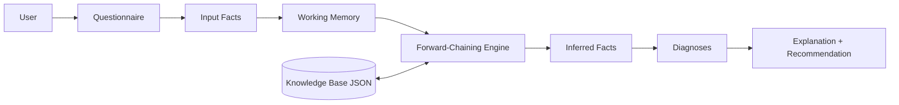

# Inference Design

## Why forward chaining

The user starts from **known symptoms** (facts) and the system must work out
**which conclusion can be supported**. That is data-driven reasoning from
facts toward a goal, which is exactly what forward chaining does. It also fits
the explanation requirement: every intermediate step can be shown.

## Working memory

`WorkingMemory` (in `engine.py`) stores:

- `user_facts` — facts provided by the user's answers,
- `inferred_facts` — facts derived by fired rules,
- `facts` — the union of both (the current state),
- `fired_rules` — an ordered trace of every rule firing.

## Rule matching

A rule is *applicable* when every fact in its `conditions` is present in the
current working memory:

```python
applicable = [r for r in rules
              if all(c in memory.facts for c in r.conditions)]
```

## Rule firing (agenda / conflict resolution)

Applicable rules are sorted so that **higher priority fires first**; the rule
ID breaks ties for determinism:

```python
applicable.sort(key=lambda r: (-r.priority, r.id))
```

Firing a rule adds its conclusions to working memory, records them as inferred
facts, and appends a `FiredRule` entry to the trace. A rule whose conclusions
are already present is skipped, which prevents pointless repeated firing.

## Fixed-point termination

The engine repeats the match/fire cycle until no rule produces a new fact:

```
while changed:
    changed = False
    for rule in applicable_rules():
        if rule produces new facts: fire, changed = True
```

Because every rule is fired at most once with the same facts, and conclusions
are only added (never removed), the process always terminates at a fixed point
— no infinite loops are possible.

## Example chain

Example reasoning structure with intermediate facts:

```
Initial facts:
  computer_running, computer_hot, fans_not_running, shuts_down_unexpectedly

Step 1 — Rule O1: IF computer_running AND computer_hot AND fans_not_running
                  THEN cooling_problem
Step 2 — Rule O3: IF cooling_problem AND shuts_down_unexpectedly
                  THEN diagnosis_overheating

Diagnosis: Overheating problem
```

The new fact `cooling_problem` from step 1 activates rule O3 in step 2 — this
is genuine multi-step forward chaining.

## Multiple diagnoses

The engine does not force a single answer. Every rule whose conditions are
satisfied fires, so several diagnoses can appear in working memory at once.
For example, a slow computer with a nearly-full, constantly active disk
produces both a Performance problem and a Storage problem.

## Insufficient evidence

If no rule reaches a `diagnosis_*` fact, the system reports that the evidence
is insufficient. Intermediate facts that *were* inferred are still shown as
partial conclusions (e.g., a "cooling problem" without unexpected shutdowns).

## Explanation tracking

Each fired rule is recorded with the facts it added. The presentation layer
uses the human-readable `explanation` attached to the rule that produced a
diagnosis, so the user sees plain-language reasoning instead of internal rule
IDs (rule IDs appear only in the optional detailed trace).

## Inference diagram


